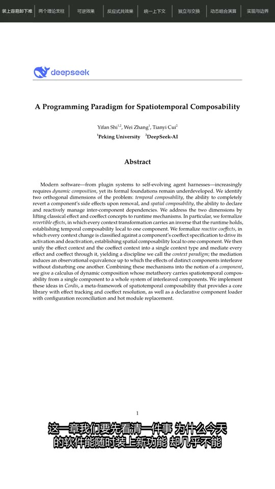

# Paper Video Agent

将研究论文 PDF 自动转换为中文竖屏讲解视频：提取分页正文并渲染完整页面，使用大模型规划
叙事与口播，通过 Edge TTS 生成词级时间戳，最后由 FFmpeg 合成配音、字幕和章节进度。

> 当前版本为 `0.1.0`（Alpha）。项目主要面向研究演示和内容创作，生成结果仍需人工核对。

## 功能

- 从 PDF 提取分页文本并渲染完整页面图像
- 使用 DeepSeek 生成视频叙事规划、章节和中文口播稿
- 按章节规划的 `source_pages` 审核口播事实并保留证据记录
- 根据事实审核全局修正、去重和精简口播，不覆盖原始脚本
- 使用 Edge TTS 生成语音与词级时间戳
- 自动切分字幕并控制每屏最多两行
- 每个解说片段展示脚本指定的完整 PDF 页面
- 输出高质量原片和适合社交平台上传的压缩版本
- 支持中断续跑，复用已有脚本和语音缓存
- 根据最终脚本生成标题、简介和标签

## 效果展示

点击封面可观看视频：已发布的示例会跳转到 Bilibili 完整视频，其余示例播放带声音的
12 秒 H.264/MP4 预览。

<table>
  <tr>
    <td align="center" width="33%">
      <a href="docs/examples/spatiotemporal-composability.mp4">
        
      </a>
    </td>
    <td align="center" width="33%">
      <a href="https://www.bilibili.com/video/BV1omeb6aE4z/">
        
      </a>
    </td>
    <td align="center" width="33%">
      <a href="https://www.bilibili.com/video/BV1CBeh67EiE/">
        
      </a>
    </td>
  </tr>
  <tr>
    <td align="center"><strong>时空可组合性编程范式</strong></td>
    <td align="center">
      <strong>35B 小模型如何打赢长任务</strong><br>
      <sub>Occamy-1.0 · <a href="https://www.bilibili.com/video/BV1omeb6aE4z/">Bilibili 完整视频</a></sub>
    </td>
    <td align="center">
      <strong>同一个模型换个外壳差多少？</strong><br>
      <sub>编码智能体 Harness · <a href="https://www.bilibili.com/video/BV1CBeh67EiE/">Bilibili 完整视频</a></sub>
    </td>
  </tr>
</table>

## 工作流程


## 环境要求

- Python 3.11 或更高版本（当前已在 Python 3.12 上验证）
- [FFmpeg](https://ffmpeg.org/) 和 `ffprobe`，且二者均已加入 `PATH`
- 可访问 DeepSeek API 与 Edge TTS 服务的网络环境
- 一个支持中文的字体

FFmpeg 需要包含 `drawtext` 和 `subtitles`（libass）滤镜。可运行以下命令检查：

```bash
ffmpeg -version
ffprobe -version
ffmpeg -filters
```

## 安装

```bash
git clone <your-repository-url>
cd paper-video-agent
python -m venv .venv
```

Windows PowerShell：

```powershell
.\.venv\Scripts\Activate.ps1
python -m pip install --upgrade pip
python -m pip install -e .
Copy-Item .env.example .env
```

macOS/Linux：

```bash
source .venv/bin/activate
python -m pip install --upgrade pip
python -m pip install -e .
cp .env.example .env
```

然后编辑 `.env`，至少配置：

```dotenv
DEEPSEEK_API_KEY=your_deepseek_api_key
DEEPSEEK_BASE_URL=https://api.deepseek.com
DEEPSEEK_MODEL=deepseek-flash
```

`.env` 已被 Git 忽略。不要将真实 API Key 写入 README、Issue、日志或提交历史。

## 使用

生成完整视频：

```bash
python -m paper_video_agent --pdf "/path/to/paper.pdf"
```

默认会在 PDF 旁创建 `<PDF文件名>_output` 工作目录。也可以指定目录：

```bash
python -m paper_video_agent \
  --pdf "/path/to/paper.pdf" \
  --paper-dir "/path/to/workdir"
```

只重新生成指定片段的预览视频：

```bash
python -m paper_video_agent \
  --pdf "/path/to/paper.pdf" \
  --paper-dir "/path/to/workdir" \
  --preview-segments 3 8 12
```

生成社交平台发布文案：

```bash
python -m paper_video_agent.social_metadata \
  --script-json "/path/to/workdir/output/paper_script.edited.json"
```

默认会在编辑稿所在目录生成：

- `social_metadata.json`：便于程序继续处理的结构化发布信息
- `social_metadata.md`：可直接复制、修改的标题、简介和标签

需要写到其他目录时，可以显式指定：

```bash
python -m paper_video_agent.social_metadata \
  --script-json "/path/to/workdir/output/paper_script.edited.json" \
  --output-dir "/path/to/metadata-output"
```

安装项目后也会提供较短的 `paper-video` 和 `paper-video-metadata` 命令。如果 Windows
安全策略禁止运行 pip 生成的未签名启动器，请继续使用上面的 `python -m` 形式。

查看帮助和版本：

```bash
python -m paper_video_agent --help
python -m paper_video_agent --version
```

## 输出目录

```text
<workdir>/
├── audio/                 # TTS 音频和时间轴清单
├── images/                # PDF 页面图像
├── subtitles/             # 分段 SRT 字幕
└── output/
    ├── segments/            # 分段视频
    ├── paper_script.json    # 叙事规划与口播稿
    ├── paper_script.cache.json # 脚本输入指纹，用于安全续跑
    ├── script_audit.json    # 逐章节、逐片段的事实审核结果
    ├── script_audit.cache.json # 审核输入指纹，用于安全续跑
    ├── paper_script.edited.json # 事实修正、去重和精简后的实际口播稿
    ├── paper_script.edited.cache.json # 编辑节点输入指纹，用于安全续跑
    ├── social_metadata.json # 结构化标题、简介和标签（运行发布文案命令后生成）
    ├── social_metadata.md   # 可直接编辑的发布文案（运行发布文案命令后生成）
    ├── final.mp4            # 高质量原片
    └── final_social.mp4     # 社交平台压缩版
```

已有的中间产物会尽量被复用。论文内容、脚本提示词、脚本结构或模型配置变化时，论文脚本会
自动失效并重新生成；TTS 和渲染配置不会影响论文脚本缓存。想从头生成时，请使用一个新的
工作目录；删除已有产物前请先备份。

事实审核严格以每章规划中的 `source_pages` 为证据范围：审核模型会看到该章完整口播和这些
页面的解析文本，不会搜索或猜测论文其他页面。指定页无法支持的说法会在
`script_audit.json` 中标记，但当前阶段不会自动修改口播或阻止视频继续生成。

编辑节点读取完整原始脚本和事实审核结果，不再次读取论文，也不会覆盖
`paper_script.json`。它会处理审核问题、跨章节重复、数字堆叠和口播表达，输出
`paper_script.edited.json`；TTS、字幕和视频使用编辑稿。该节点不设置固定时长目标，避免为了
缩短而删掉理解核心方法所必需的内容。

## 配置

所有配置均可写入项目根目录的 `.env` 或设置为系统环境变量。

| 变量 | 默认值 | 说明 |
| --- | --- | --- |
| `DEEPSEEK_API_KEY` | 无 | DeepSeek API Key |
| `DEEPSEEK_BASE_URL` | `https://api.deepseek.com` | 兼容接口地址 |
| `DEEPSEEK_MODEL` | `deepseek-flash` | 使用的模型名称 |
| `PAPER_VIDEO_TTS_VOICE` | `zh-CN-XiaoxiaoNeural` | Edge TTS 音色 |
| `PAPER_VIDEO_TTS_RATE` | `+25%` | 语速，约为正常速度的 1.25 倍 |
| `PAPER_VIDEO_TTS_PITCH` | `+0Hz` | 音高 |
| `PAPER_VIDEO_TTS_CONCURRENCY` | `4` | 并发生成语音的数量 |
| `PAPER_VIDEO_VIDEO_CONCURRENCY` | `3` | 并发合成视频的数量 |
| `PAPER_VIDEO_FONT_NAME` | 平台相关 | FFmpeg 使用的中文字体名称 |
| `PAPER_VIDEO_FONT_PATH` | 无 | 中文字体文件的绝对路径，优先于字体名称 |

Windows 会自动尝试微软雅黑。macOS/Linux 建议安装 Noto Sans CJK，并按实际字体名称或路径配置。

## 开发

```bash
python -m pip install -e ".[dev]"
ruff check .
pytest
```

贡献流程见 [CONTRIBUTING.md](CONTRIBUTING.md)，安全问题报告方式见 [SECURITY.md](SECURITY.md)。

## 已知限制

- 大模型输出可能存在事实错误、遗漏或不准确引用，发布前必须对照原论文审阅。
- 复杂双栏排版、扫描版 PDF、特殊公式和非常规表格可能无法准确提取。
- 完整视频生成会调用第三方网络服务并产生 API 费用。
- 视频合成速度和内存占用与论文页数、分辨率及并发设置有关。
- 当前主要生成中文、9:16 竖屏视频，尚未提供完整的样式配置接口。

## 内容与隐私

上传论文内容到第三方模型服务前，请确认论文、数据及附件允许这样处理。不要处理包含个人隐私、
商业机密或受限制数据的文档。论文、插图、字体、配音和生成视频的版权与平台合规责任由使用者承担。

## License

[MIT](LICENSE)
