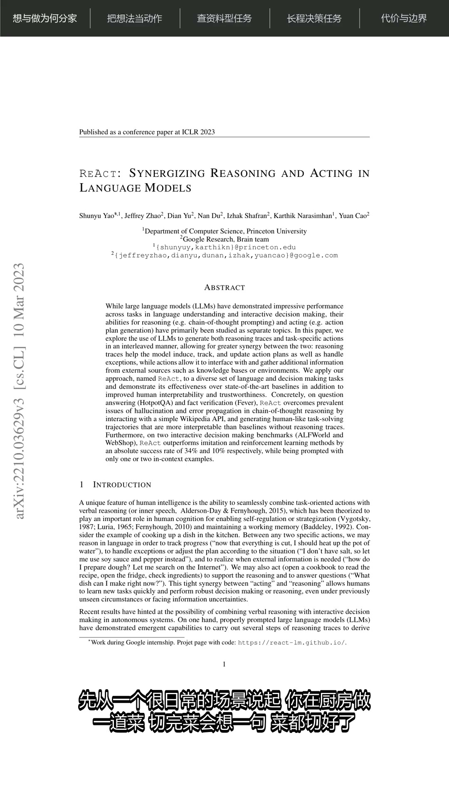
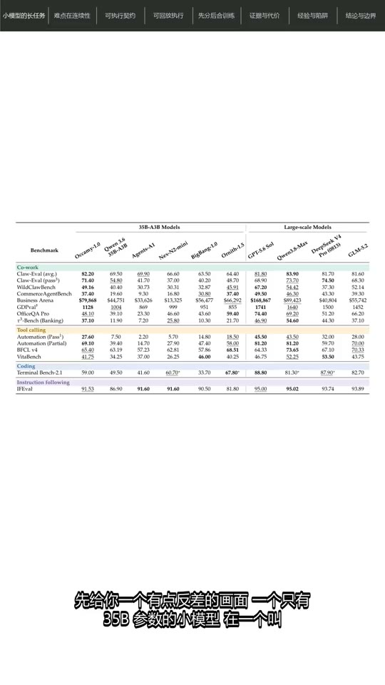
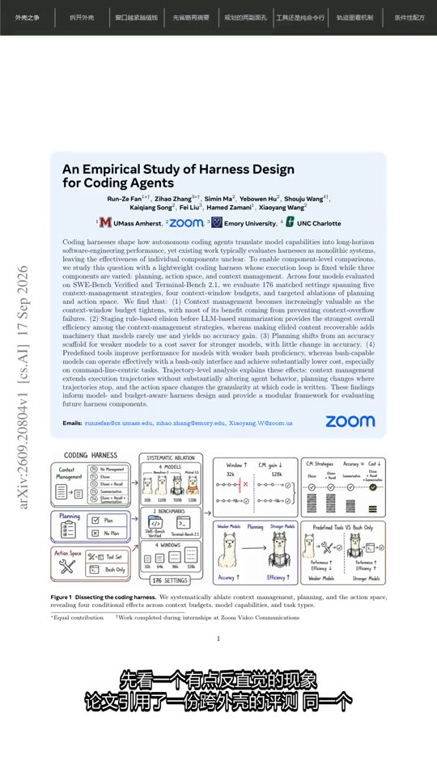
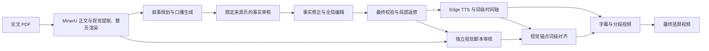

# Research Agent Workbench

> 面向研究内容理解与创作的多 Agent 工作台。

当前已实现的第一个 Agent 是 **Paper Video Agent**：不是把论文念一遍，而是把论文讲明白。
它可以输入研究论文 PDF，自动完成结构化解析、中文讲稿、事实审核、配音字幕和图表聚焦，
低成本生成可直接发布的竖屏精讲视频。

后续将逐步加入技术报告与网页解说、论文总结、论文对比、写作辅助和格式检查等独立 Agent。
各 Agent 保持任务边界清晰，同时复用内容审核、语音字幕、视觉编排和视频渲染等基础能力。

> 当前可用版本为 Paper Video Agent `0.2.0`（Beta）。项目主要面向研究演示和内容创作，
> 生成结果仍需人工核对。

## Agents

| Agent | 状态 | 用途 |
| --- | --- | --- |
| `paper_video_agent` | Beta，可用 | 将论文 PDF 转换为有依据、会聚焦图表的中文精讲视频 |
| `tech_explainer_agent` | 规划中 | 将官方技术博客、产品报告和文档转换为中文解说视频 |

现阶段的安装与使用说明均针对 `paper_video_agent`。

## Paper Video Agent 特点

- **快速理解论文**：把论文的研究问题、方法、实验和结论组织成结构清晰的中文讲解。
- **讲解与原文画面对齐**：默认展示完整 PDF 页面；讲到具体图片、表格、公式或代码时，自动聚焦
  对应的 MinerU 素材。
- **讲稿可审核、结果可追溯**：通过来源页约束、事实审核和最终校验降低错误风险，并保留脚本、
  审核结果和视觉时间轴等中间产物。
- **从 PDF 直接生成成片**：自动完成讲稿、配音、字幕、章节导航和视频合成，而不只输出文本摘要。
- **生成成本低**：作者当前使用 DeepSeek Flash 生成一条完整视频时，大模型调用费用实测低于
  `¥1`。实际费用会随论文长度、模型定价和重试次数变化，且不包含本地算力、网络及其他第三方
  服务可能产生的费用。
- **支持续跑与局部重做**：复用解析、脚本、语音和分段视频缓存，修改部分内容时无需从头生成。

## 当前功能

- 使用 MinerU 官网 API 提取 PDF 分页文本、图片、表格、公式和带标题代码块，并渲染完整页面图像
- 使用 DeepSeek 生成视频叙事规划、章节和中文口播稿
- 按章节规划的 `source_pages` 审核口播事实并保留证据记录
- 根据事实审核全局修正、去重和精简口播，不覆盖原始脚本
- 对编辑稿执行结构、重复、数字和审核遗留问题校验，失败时局部返修
- 使用 Edge TTS 生成语音与词级时间戳
- 自动切分字幕并控制每屏最多两行
- 默认展示脚本指定的完整 PDF 页面，讲解具体视觉元素时临时聚焦 MinerU 素材
- 自动合并同一视觉素材的短间隔聚焦，减少 PDF 页面与素材之间的频繁闪切
- 输出高质量原片和适合社交平台上传的压缩版本
- 支持中断续跑，复用已有脚本和语音缓存
- 根据最终脚本生成标题、简介和标签

## 效果展示

点击封面可前往 Bilibili 观看完整视频。

<table>
  <tr>
    <td align="center" width="33%">
      <a href="https://www.bilibili.com/video/BV1oXhy6YEK4/">
        
      </a>
    </td>
    <td align="center" width="33%">
      <a href="https://www.bilibili.com/video/BV1omeb6aE4z/">
        
      </a>
    </td>
    <td align="center" width="33%">
      <a href="https://www.bilibili.com/video/BV1CBeh67EiE/">
        
      </a>
    </td>
  </tr>
  <tr>
    <td align="center">
      <strong>ReAct：让大模型边想边做</strong><br>
      <sub>ReAct · <a href="https://www.bilibili.com/video/BV1oXhy6YEK4/">Bilibili 完整视频</a></sub>
    </td>
    <td align="center">
      <strong>35B 小模型如何打赢长任务</strong><br>
      <sub>Occamy-1.0 · <a href="https://www.bilibili.com/video/BV1omeb6aE4z/">Bilibili 完整视频</a></sub>
    </td>
    <td align="center">
      <strong>同一个模型换个外壳差多少？</strong><br>
      <sub>编码智能体 Harness · <a href="https://www.bilibili.com/video/BV1CBeh67EiE/">Bilibili 完整视频</a></sub>
    </td>
  </tr>
</table>

## 工作流程



## 环境要求

- Python 3.11 或更高版本（当前已在 Python 3.12 上验证）
- [FFmpeg](https://ffmpeg.org/) 和 `ffprobe`，且二者均已加入 `PATH`
- 可访问 MinerU、DeepSeek API 与 Edge TTS 服务的网络环境
- 一个支持中文的字体

FFmpeg 需要包含 `drawtext` 和 `subtitles`（libass）滤镜。可运行以下命令检查：

```bash
ffmpeg -version
ffprobe -version
ffmpeg -filters
```

## 安装

```bash
git clone https://github.com/QXP1997/research-agent-workbench.git
cd research-agent-workbench
python -m venv .venv
```

Windows PowerShell：

```powershell
.\.venv\Scripts\Activate.ps1
python -m pip install --upgrade pip
python -m pip install -e .
Copy-Item .env.example .env
```

macOS/Linux：

```bash
source .venv/bin/activate
python -m pip install --upgrade pip
python -m pip install -e .
cp .env.example .env
```

然后编辑 `.env`，至少配置 DeepSeek 和 MinerU 的 API Key：

```dotenv
DEEPSEEK_API_KEY=your_deepseek_api_key
DEEPSEEK_BASE_URL=https://api.deepseek.com
DEEPSEEK_MODEL=deepseek-flash
MINERU_API_KEY=your_mineru_api_key
```

`.env` 已被 Git 忽略。不要将真实 API Key 写入 README、Issue、日志或提交历史。

## 使用

生成完整视频：

```bash
python -m paper_video_agent --pdf "/path/to/paper.pdf"
```

默认会在 PDF 旁创建 `<PDF文件名>_output` 工作目录。也可以指定目录：

```bash
python -m paper_video_agent \
  --pdf "/path/to/paper.pdf" \
  --paper-dir "/path/to/workdir"
```

只重新生成指定片段的预览视频：

```bash
python -m paper_video_agent \
  --pdf "/path/to/paper.pdf" \
  --paper-dir "/path/to/workdir" \
  --preview-segments 3 8 12
```

生成社交平台发布文案：

```bash
python -m paper_video_agent.social_metadata \
  --script-json "/path/to/workdir/output/paper_script.final.json"
```

默认会在编辑稿所在目录生成：

- `social_metadata.json`：便于程序继续处理的结构化发布信息
- `social_metadata.md`：可直接复制、修改的标题、简介和标签

需要写到其他目录时，可以显式指定：

```bash
python -m paper_video_agent.social_metadata \
  --script-json "/path/to/workdir/output/paper_script.final.json" \
  --output-dir "/path/to/metadata-output"
```

安装项目后也会提供较短的 `paper-video` 和 `paper-video-metadata` 命令。如果 Windows
安全策略禁止运行 pip 生成的未签名启动器，请继续使用上面的 `python -m` 形式。

查看帮助和版本：

```bash
python -m paper_video_agent --help
python -m paper_video_agent --version
```

## 输出目录

```text
<workdir>/
├── audio/                 # TTS 音频和时间轴清单
├── images/                # PDF 页面图像
├── subtitles/             # 分段 SRT 字幕
└── output/
    ├── mineru/              # MinerU ZIP 解压后的完整原始结果（ZIP 本身不保留）
    ├── mineru_parse.json   # MinerU 分页文本、图表公式目录与源 PDF 指纹缓存
    ├── focus_assets/        # 聚焦素材；含视觉清单 visual_assets.json 与 bbox 局部裁剪图
    ├── segments/            # 分段视频及对应的输入指纹缓存 *.mp4.cache.json
    ├── paper_script.json    # 叙事规划与未经后处理的原始口播稿
    ├── paper_script.cache.json # 脚本输入指纹，用于安全续跑
    ├── script_audit.json    # 逐章节、逐片段的事实审核结果
    ├── script_audit.cache.json # 审核输入指纹，用于安全续跑
    ├── paper_script.edited.json # 事实修正、去重和精简后的候选口播稿
    ├── paper_script.edited.cache.json # 编辑节点输入指纹，用于安全续跑
    ├── script_validation.json # 最终确定性校验与返修记录
    ├── paper_script.final.json # 校验通过、实际用于视频的最终脚本
    ├── paper_script.final.cache.json # 最终校验输入指纹，用于安全续跑
    ├── visual_review.json  # 独立视觉脚本审核（口播原文锚点）
    ├── visual_review_cache/ # 按章节缓存的视觉审核结果
    ├── visual_timeline.json # 与 TTS 词级时间戳对齐后的切换时间轴
    ├── social_metadata.json # 结构化标题、简介和标签（运行发布文案命令后生成）
    ├── social_metadata.md   # 可直接编辑的发布文案（运行发布文案命令后生成）
    ├── final.mp4            # 高质量原片
    └── final_social.mp4     # 社交平台压缩版
```

已有的中间产物会尽量被复用。论文内容、脚本提示词、脚本结构或模型配置变化时，论文脚本会
自动失效并重新生成；TTS 和渲染配置不会影响论文脚本缓存。想从头生成时，请使用一个新的
工作目录；删除已有产物前请先备份。

`paper_script.json` 的 `visuals` 保留 MinerU 识别的图、表、公式和带标题代码块；
当某段口播明确讲解其中一个元素时，`segment.visual_id` 会引用它。没有合适图表时该字段为
`null`，不会为了填充而强行绑定。

最终口播通过后，独立的视觉脚本审核节点会再根据口播、caption 和页面证据复核
是否真的需要聚焦。默认保持 PDF 全页；只在讲解具体图、表、公式或代码时，按口播
原文锚点临时切换到 MinerU 素材，讲解结束后自动切回全页。时间锚点无法与 TTS 可靠
对齐、区间重叠或聚焦不足两秒时，会安全降级为 PDF 全页。

相邻两次聚焦如果使用同一素材、间隔不超过 5 秒，会自动合并为连续展示，避免在短暂
补充说明期间来回闪切。可通过 `PAPER_VIDEO_VISUAL_MERGE_GAP_SECONDS` 调整该阈值；设为
`0` 时只合并首尾相接的区间。

视觉审核按章节缓存。输入未变化时，可人工检查或修改 `visual_review.json` 后续跑；文件通过
结构校验后会被直接复用。`visual_timeline.json` 会根据 TTS 词级时间戳重新生成，不建议手工
编辑。视觉 cue、聚焦素材或渲染配置发生变化时，只有受影响的分段视频缓存会失效，TTS 无需
重新生成。

事实审核严格以每章规划中的 `source_pages` 为证据范围：审核模型会看到该章完整口播和这些
页面的解析文本，不会搜索或猜测论文其他页面。指定页无法支持的说法会在
`script_audit.json` 中标记，但当前阶段不会自动修改口播或阻止视频继续生成。

编辑节点读取完整原始脚本和事实审核结果，不再次读取论文，也不会覆盖
`paper_script.json`。它会处理审核问题、跨章节重复、数字堆叠和口播表达，输出
`paper_script.edited.json`。该节点不设置固定时长目标，避免为了缩短而删掉理解核心方法所
必需的内容。

最终校验节点优先使用确定性规则检查章节结构、页面范围、完全或高度相似的重复段落、单段
数字密度、未经原始脚本或审核支持的新数字、过长段落，以及中高风险审核陈述是否原样残留。
数字偏多、段落偏长、轻度重复和中风险审核遗留只写入 `script_validation.json` 作为非阻断
提醒，不再触发返修或阻止视频。只有新数字、非法页面、结构错误或高风险事实问题才调用大
模型做最多两轮局部返修；高风险问题仍未解决时才停止生成。通过后的
`paper_script.final.json` 会交给 TTS、字幕和视频流程。

## 配置

所有配置均可写入项目根目录的 `.env` 或设置为系统环境变量。

| 变量 | 默认值 | 说明 |
| --- | --- | --- |
| `DEEPSEEK_API_KEY` | 无 | DeepSeek API Key |
| `DEEPSEEK_BASE_URL` | `https://api.deepseek.com` | 兼容接口地址 |
| `DEEPSEEK_MODEL` | `deepseek-flash` | 使用的模型名称 |
| `MINERU_API_KEY` | 无 | MinerU 官网 API Token（只写入本地 `.env`，不写入 `.env.example`） |
| `PAPER_VIDEO_TTS_VOICE` | `zh-CN-XiaoxiaoNeural` | Edge TTS 音色 |
| `PAPER_VIDEO_TTS_RATE` | `+25%` | 语速，约为正常速度的 1.25 倍 |
| `PAPER_VIDEO_TTS_PITCH` | `+0Hz` | 音高 |
| `PAPER_VIDEO_TTS_CONCURRENCY` | `4` | 并发生成语音的数量 |
| `PAPER_VIDEO_VIDEO_CONCURRENCY` | `3` | 并发合成视频的数量 |
| `PAPER_VIDEO_VISUAL_MERGE_GAP_SECONDS` | `5` | 相同视觉素材连续展示的最大间隔（秒） |
| `PAPER_VIDEO_FONT_NAME` | 平台相关 | FFmpeg 使用的中文字体名称 |
| `PAPER_VIDEO_FONT_PATH` | 无 | 中文字体文件的绝对路径，优先于字体名称 |

Windows 会自动尝试微软雅黑。macOS/Linux 建议安装 Noto Sans CJK，并按实际字体名称或路径配置。

## 代码结构与复用原则

项目按“领域 Agent + 共享能力”组织，新 Agent 应优先组合共享模块，不重复实现缓存、配音、字幕和
时间轴逻辑：

```text
src/
├── qharness/              # 独立的 Coding Agent Harness 子项目，保留自己的包、测试和 Git 历史
├── research_agent_core/   # Agent 通用基础设施：文档解析、缓存、环境配置和提示词序列化
│   └── document/          # 共享 PDF/MinerU 解析、视觉元素提取、解析缓存和整页渲染
├── research_video_core/   # 视频通用能力：TTS、字幕切分、SRT、音频与视觉时间轴
└── paper_video_agent/     # 论文领域逻辑：论文规划、事实审核、视觉编排和视频流水线
```

`paper_video_agent` 的旧导入路径继续保留兼容；后续论文总结、论文对比等 Agent 可以直接复用公共
PDF 解析结果，技术网页解说等 Agent 也可以复用缓存与视频能力，只实现自己的内容采集、证据模型
和讲稿规划。共享模块不应反向依赖具体 Agent。

QHarness 作为仓库内的独立 Python 子项目维护。需要开发或运行 Agent Loop 时，在同一虚拟环境中
额外执行：

```bash
python -m pip install -e ./src/qharness
```

根项目不会复制 QHarness 的运行时实现，也不会把它的嵌套源码打进 `paper-video-agent` 包；后续
Presentation Agent 通过公开的 `qharness` 包接口接入循环、工具、恢复和验证能力。

## 开发

```bash
python -m pip install -e ".[dev]"
ruff check .
pytest
```

贡献流程见 [CONTRIBUTING.md](CONTRIBUTING.md)，安全问题报告方式见 [SECURITY.md](SECURITY.md)。

## 已知限制

- 大模型输出可能存在事实错误、遗漏或不准确引用，发布前必须对照原论文审阅。
- MinerU 对复杂双栏排版、扫描件、公式和表格的识别结果仍可能需要人工核对。
- 完整视频生成会调用第三方网络服务并产生 API 费用。
- 视频合成速度和内存占用与论文页数、分辨率及并发设置有关。
- 当前主要生成中文、9:16 竖屏视频，尚未提供完整的样式配置接口。

## 内容与隐私

上传论文内容到第三方模型服务前，请确认论文、数据及附件允许这样处理。不要处理包含个人隐私、
商业机密或受限制数据的文档。论文、插图、字体、配音和生成视频的版权与平台合规责任由使用者承担。

## License

[MIT](LICENSE)
